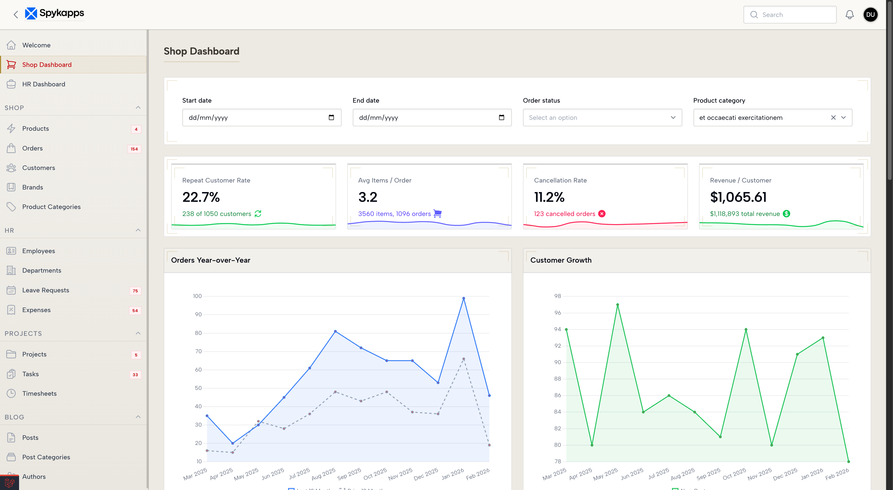
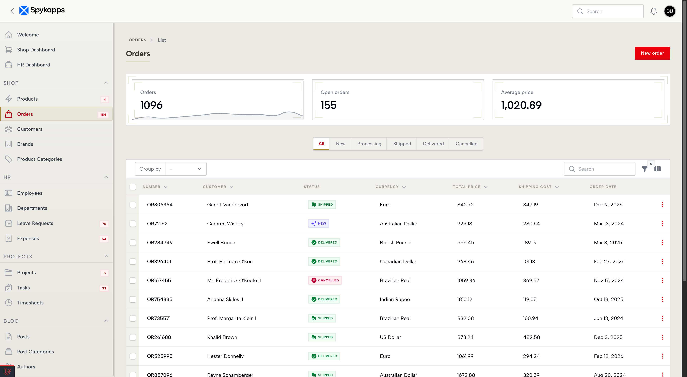
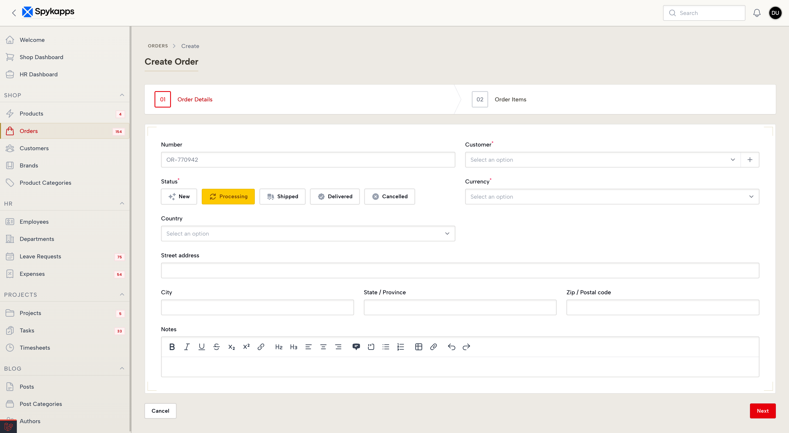
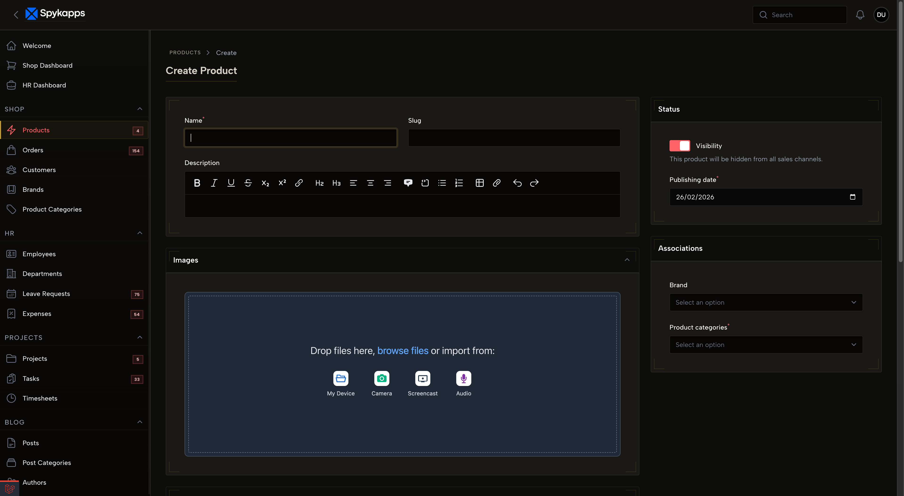
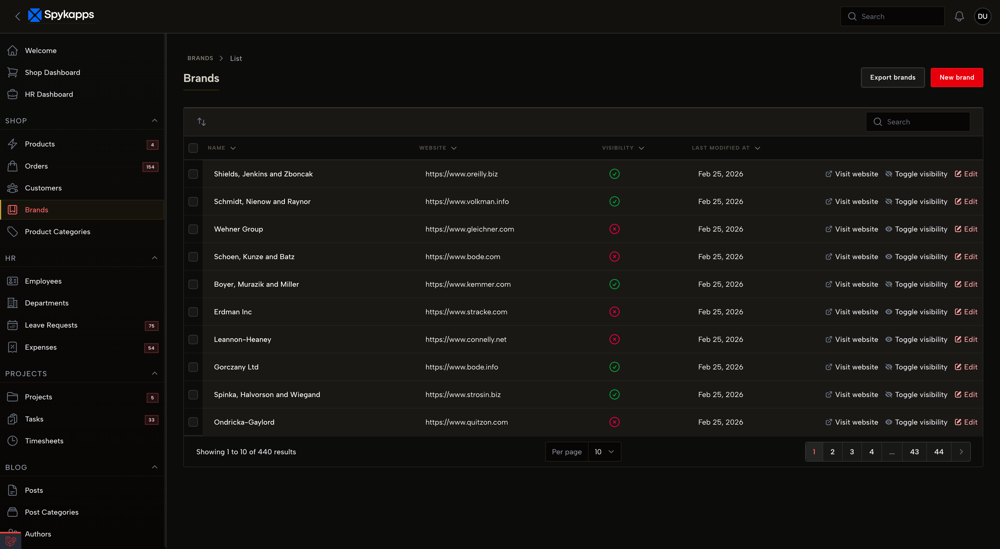
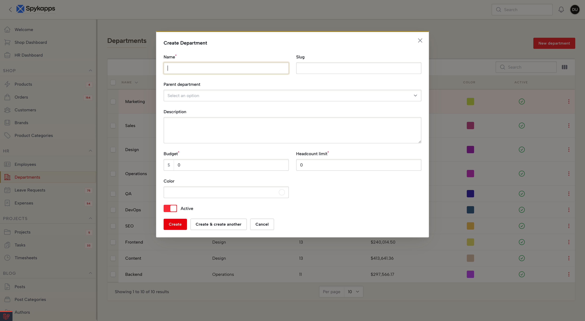

<p align="center">
   <a href="https://packagist.org/packages/spykapps/theme-edinburgh">
    
   </a>
   <a href="https://packagist.org/packages/spykapps/theme-edinburgh">
    
   </a>
   <a href="https://laravel.com/docs/12.x"></a>
   <a href="https://php.net"></a>
   <a href="https://github.com/spykapps/theme-edinburgh/blob/main/LICENSE.md">
     
   </a>
</p>

# Edinburgh - A Royal Filament Theme by Spykapps

A regal Filament theme inspired by Edinburgh's Old Town, stone-gray surfaces, brass accents, heavy borders, gradient sidebars, and ornate corner bracket details. Designed for Filament v4 and v5.

---

## Screenshots

|  |  |
| --- | --- |
|  |  |
|  |  |
|  |  |

## Installation

```bash
composer require spykapps/theme-edinburgh
```

Then run the install command:

```bash
php artisan edinburgh:install
```

The command will:

1. Detect your Filament panels (or ask you to choose one if multiple exist)
2. Create a theme CSS file if one doesn't exist yet
3. Add the Edinburgh stylesheet import automatically

### Register the Plugin

Add the plugin to your panel provider:

```php
use SpyApp\ThemeEdinburgh\ThemeEdinburghPlugin;

public function panel(Panel $panel): Panel
{
    return $panel
        // ...
        ->plugin(ThemeEdinburghPlugin::make());
}
```

### Compile Assets

```bash
npm run build
```

## Features

* **Stone & brass palette** — Warm sandstone surfaces with aged brass gold accents
* **Gradient sidebar** — Subtle top-to-bottom gradient mimicking old stone walls
* **Brass crown borders** — 3px brass top-borders on modals, dropdowns, and auth cards
* **Left-border navigation** — Sidebar items use left-border indicators instead of background fills
* **Corner brackets** — Ornate L-shaped brass brackets on sections and stat cards
* **Recessed inputs** — Inset shadows for a carved-into-stone feel
* **Gradient buttons** — Primary buttons with polished brass gradient and inner glow
* **Heavy table headers** — Background-filled headers with double bottom borders
* **Dark mode** — Deep warm-black tones with brighter brass for contrast
* **Circular avatars** — Round avatars with 2px border and brass hover ring

## Credits

* [Sanchit Patil](https://github.com/sanchitspatil)
* [All Contributors](../../contributors)

## License

The MIT License (MIT). Please see [License File](LICENSE.md) for more information.
